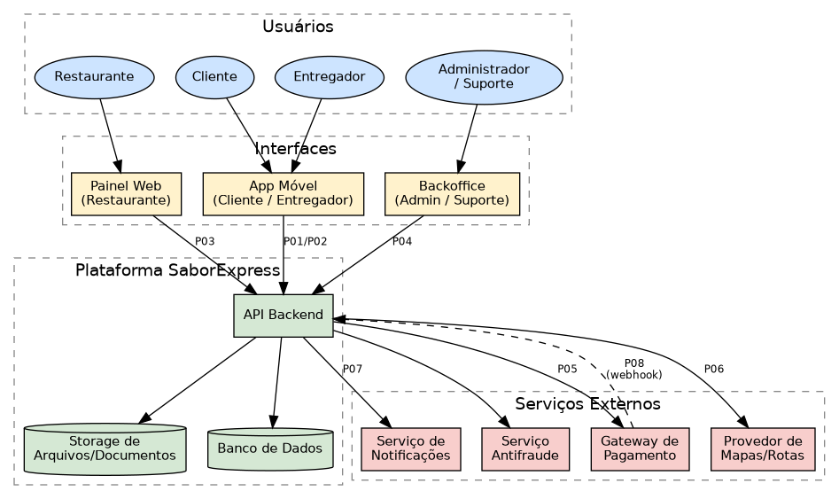
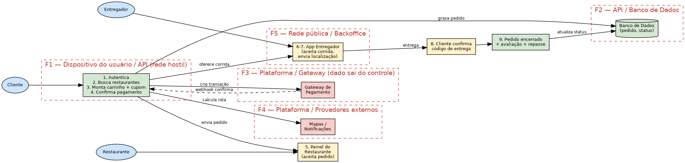

# Etapa 1 — Casos de Abuso e Modelagem de Ameaças com STRIDE

**Sistema:** SaborExpress — plataforma de delivery de comida
**Grupo:** 16 — Engenharia de Software Seguro
**Última atualização:** <!-- atualize a data ao editar --> 08/08/2026

> **Como usar este documento:** cada seção tem um responsável marcado em comentário HTML.
> Blocos marcados com `<!-- TODO -->` ainda precisam ser preenchidos. A divisão completa das
> tarefas está em [backlog.md](backlog.md).

---

## Sumário

1. [Identificação do sistema](#1-identificação-do-sistema)
2. [Descrição do sistema](#2-descrição-do-sistema)
3. [Usuários, ativos e pontos de interação](#3-usuários-ativos-e-pontos-de-interação)
4. [Visão geral da arquitetura e do fluxo de dados](#4-visão-geral-da-arquitetura-e-do-fluxo-de-dados)
5. [Modelagem de ameaças com STRIDE](#5-modelagem-de-ameaças-com-stride)
6. [Casos de abuso](#6-casos-de-abuso)
7. [Considerações finais da Etapa 1](#7-considerações-finais-da-etapa-1)

---

## 1. Identificação do sistema

<!-- RESPONSÁVEL: Felipe -->

| Item | Valor |
|---|---|
| Nome do sistema | **SaborExpress** |
| Tipo | Aplicativo/plataforma de delivery de comida |
| Grupo | 16 |
| Repositório | https://github.com/felipedresch/ess-grupo-16 |

**Integrantes:** Felipe Nestor Dresch, Deivid Alfonso Beise, Gabriel Rodrigues da Rocha,
Luis Fillipe Dias Alves, Murillo Dias Nunes e Fernando Nicola Correa.

**Justificativa da escolha:** ver [README.md, seção 1](../README.md#justificativa-da-escolha-do-sistema).
Em resumo, o sistema reúne quatro perfis de usuário com interesses conflitantes, movimentação
financeira real, dados pessoais protegidos pela LGPD e forte requisito de disponibilidade em
horários de pico — condições que permitem identificar ameaças concretas em todas as seis
categorias do STRIDE.

---

## 2. Descrição do sistema

<!-- RESPONSÁVEL: Felipe -->

### 2.1 Qual problema o sistema resolve

O **SaborExpress** é uma plataforma que conecta três partes que, sozinhas, teriam dificuldade de
se encontrar: pessoas que querem receber comida em casa, restaurantes que querem vender além do
salão e entregadores que querem trabalhar por demanda. A plataforma resolve, ao mesmo tempo:

- **descoberta** — o cliente encontra restaurantes disponíveis próximos ao seu endereço;
- **transação** — o pedido é registrado, pago e confirmado de forma rastreável;
- **logística** — um entregador é alocado ao pedido e sua posição é acompanhada em tempo real;
- **confiança** — avaliações, histórico e suporte reduzem o risco de cada parte ser lesada.

O SaborExpress atua como **intermediário financeiro**: ele recebe o pagamento do cliente, retém
uma comissão e repassa o restante ao restaurante e ao entregador em ciclos periódicos. Essa
característica é central para a análise de segurança, porque coloca dinheiro de terceiros sob
custódia da plataforma.

### 2.2 Quem utiliza o sistema

| Perfil | Descrição | Interface principal |
|---|---|---|
| **Cliente** | Pessoa física que busca restaurantes, monta o carrinho, paga e acompanha a entrega. | Aplicativo móvel (Android/iOS) e site |
| **Restaurante (lojista)** | Estabelecimento que cadastra o cardápio, aceita ou recusa pedidos e informa o preparo. | Painel web e app do parceiro (tablet na cozinha) |
| **Entregador** | Trabalhador autônomo que aceita corridas, retira o pedido e o entrega. | Aplicativo móvel com GPS ativo |
| **Administrador da plataforma** | Equipe interna que homologa restaurantes, gerencia cupons, media disputas e emite reembolsos. | Backoffice web restrito |
| **Atendimento (suporte)** | Subconjunto do administrador com permissões reduzidas para atender chamados. | Backoffice web restrito |

Há ainda **agentes externos** que não são usuários, mas participam dos fluxos: gateway de
pagamento, provedor de mapas e rotas, serviço de notificações (push/SMS/e-mail) e serviço
antifraude.

### 2.3 Principais funcionalidades

**Cliente**
1. Cadastro e autenticação (e-mail/senha ou login social), com verificação de telefone.
2. Cadastro de endereços de entrega e de meios de pagamento (cartão tokenizado, Pix, carteira).
3. Busca de restaurantes por localização, categoria e disponibilidade.
4. Montagem do carrinho, aplicação de cupons e finalização do pedido.
5. Pagamento no app ou na entrega.
6. Acompanhamento do pedido em tempo real, com posição do entregador no mapa.
7. Chat com o entregador e com o suporte.
8. Avaliação do restaurante e do entregador.
9. Abertura de chamado para pedido não entregue, incorreto ou de má qualidade, com pedido de
   reembolso.

**Restaurante**
10. Cadastro do estabelecimento com envio de documentos (CNPJ, alvará, contrato social).
11. Gestão do cardápio, preços, promoções e horário de funcionamento.
12. Recebimento, aceite e recusa de pedidos; atualização do status de preparo.
13. Consulta de repasses financeiros e emissão de relatórios de vendas.

**Entregador**
14. Cadastro com envio de documentos (CNH, comprovante de veículo, selfie de verificação).
15. Ficar disponível, receber ofertas de corrida e aceitá-las.
16. Compartilhamento contínuo de localização durante a corrida.
17. Confirmação de coleta e de entrega (com código de confirmação do cliente).
18. Consulta de ganhos, gorjetas e saques.

**Administrador**
19. Homologação e suspensão de restaurantes e entregadores.
20. Criação e gestão de cupons e campanhas promocionais.
21. Mediação de disputas, estorno e reembolso de pedidos.
22. Consulta a logs e relatórios operacionais e financeiros.

### 2.4 Informações armazenadas ou transmitidas

- **Dados cadastrais e pessoais:** nome completo, CPF/CNPJ, e-mail, telefone, data de nascimento.
- **Endereços de entrega**, incluindo complemento e ponto de referência — informação que
  identifica onde a pessoa mora.
- **Credenciais:** hash de senha, tokens de sessão, tokens de recuperação de senha, segredos de
  MFA e chaves de API dos parceiros.
- **Dados de pagamento:** token do cartão, bandeira e últimos 4 dígitos, chaves Pix, dados
  bancários de restaurantes e entregadores para repasse.
- **Documentos:** CNH e selfie do entregador, alvará e contrato social do restaurante.
- **Geolocalização em tempo real** do entregador e localização aproximada do cliente.
- **Histórico de pedidos e de consumo**, que revela hábitos, rotina e — indiretamente —
  restrições alimentares, religiosas ou de saúde.
- **Mensagens** trocadas entre cliente, entregador e suporte.
- **Avaliações e comentários.**
- **Registros financeiros:** transações, comissões, repasses, estornos e cupons.
- **Logs de auditoria** de operações sensíveis.

### 2.5 Recursos que precisam ser protegidos

Em ordem de criticidade percebida pelo grupo:

1. **Fluxo financeiro** (pagamentos, repasses, cupons e reembolsos) — perda direta de dinheiro.
2. **Dados pessoais dos clientes**, com destaque para endereço + telefone + rotina, cuja
   exposição habilita danos físicos, não apenas digitais.
3. **Credenciais e sessões** de todos os perfis — porta de entrada para os demais ativos.
4. **Integridade dos pedidos** (itens, preço, endereço e status).
5. **Disponibilidade do serviço** nos horários de pico.
6. **Documentos de identificação** de entregadores e restaurantes.
7. **Reputação** construída pelas avaliações.

---

## 3. Usuários, ativos e pontos de interação

<!-- RESPONSÁVEL: Deivid -->

### 3.1 Perfis de acesso e o que cada um pode fazer

| Perfil | Autenticação | Permissões principais | Não pode |
|---|---|---|---|
| Visitante | Nenhuma | Buscar restaurantes, ver cardápios | Pedir, ver dados de terceiros |
| Cliente | E-mail/senha + verificação de telefone | Cadastrar endereços e meios de pagamento, buscar restaurantes, montar carrinho, aplicar cupons, pagar, acompanhar entrega em tempo real, conversar via chat com entregador/suporte, avaliar, abrir chamado | Ver pedidos ou dados de outros clientes, alterar valor do pedido após confirmação |
| Restaurante | E-mail/senha (conta do estabelecimento) | Gerir cardápio e preços, aceitar/recusar pedidos, atualizar status de preparo, consultar repasses financeiros e relatórios de vendas próprios | Ver dados completos do cliente (além do necessário para a entrega), alterar comissões, ver pedidos de outros restaurantes |
| Entregador | E-mail/senha + verificação de documentos | Ficar disponível, aceitar corridas, compartilhar localização durante a corrida, ver endereço do pedido ativo, confirmar coleta/entrega, consultar ganhos/gorjetas/saques | Ver histórico de pedidos anteriores do cliente, ver endereço fora de uma corrida ativa |
| Suporte | SSO corporativo | Consultar pedidos, abrir estorno até um limite pré-definido | Alterar comissões, criar cupons, homologar ou suspender restaurantes/entregadores |
| Administrador | SSO corporativo + MFA | Todas as operações do backoffice: homologação, cupons, mediação de disputas, estorno, consulta a logs e relatórios | Operar sem gerar log de auditoria (toda ação sensível deve ficar registrada) |

### 3.2 Ativos

Classificação: **Crítico** (prejuízo grave, difícil recuperação), **Alto**, **Médio** ou **Baixo**.

| ID | Ativo | Tipo | Onde reside | Criticidade | Por que é um ativo |
|---|---|---|---|---|---|
| A01 | Credenciais de acesso (hash de senha, tokens de sessão) | Dado | Banco de dados, dispositivo do usuário | Crítico | Dá acesso a todos os demais ativos daquele usuário |
| A02 | Dados de pagamento (token de cartão, chave Pix, conta bancária) | Dado | Gateway externo + banco de dados | Crítico | Permite fraude financeira direta |
| A03 | Endereço residencial e telefone do cliente | Dado pessoal | Banco de dados, app do entregador | Crítico | Exposição habilita perseguição e violência física |
| A04 | Geolocalização em tempo real do entregador | Dado pessoal | Serviço de rastreamento | Alto | Permite rastrear a rotina de uma pessoa |
| A05 | Registros financeiros (pedidos, comissões, repasses) | Dado | Banco de dados | Crítico | Alteração causa prejuízo direto à plataforma e aos parceiros |
| A06 | Cupons e campanhas promocionais | Dado/Regra | Banco de dados | Alto | Abuso gera prejuízo financeiro em escala |
| A07 | Documentos de entregadores e restaurantes (CNH, alvará) | Dado sensível | Storage de arquivos | Alto | Vazamento habilita fraude de identidade |
| A08 | Logs de auditoria | Dado | Serviço de logs | Alto | Sem eles não é possível provar o que aconteceu |
| A09 | API de pedidos (backend) | Componente | Servidores da plataforma | Crítico | Ponto central de todas as operações |
| A10 | Banco de dados principal | Componente | Infraestrutura da plataforma | Crítico | Concentra praticamente todos os dados |
| A11 | Mensagens do chat (cliente ↔ entregador ↔ suporte) | Dado pessoal | Servidor de mensagens / banco de dados | Médio | Pode conter combinações sensíveis (ex: instruções de entrega, reclamações) e, se vazado, expõe a comunicação privada entre as partes |
| A12 | Painel administrativo (backoffice) | Componente | Servidores da plataforma | Crítico | Concentra acesso a estornos, cupons, dados de todos os usuários e homologação de contas — comprometê-lo compromete o sistema inteiro |
| A13 | Chaves de API dos serviços externos (gateway, mapas, notificações, antifraude) | Segredo | Variáveis de ambiente / cofre de segredos do backend | Crítico | Vazamento permite que um atacante se passe pela plataforma perante os serviços externos, gerando fraude financeira ou abuso de cota |
| A14 | Avaliações e reputação (nota do restaurante e do entregador) | Dado | Banco de dados | Médio | Manipulação em massa (avaliações falsas) distorce a confiança do sistema e pode prejudicar ou favorecer indevidamente um restaurante/entregador |

### 3.3 Pontos de interação (superfície de ataque)

| ID | Ponto de interação | Quem acessa | Dados que trafegam |
|---|---|---|---|
| P01 | App móvel do cliente → API | Cliente | Credenciais, endereço, pedido, pagamento |
| P02 | App do entregador → API | Entregador | Localização, status da entrega, código de confirmação |
| P03 | Painel do restaurante → API | Restaurante | Cardápio, preços, status do pedido |
| P04 | Backoffice → API administrativa | Admin/Suporte | Reembolsos, cupons, dados de usuários |
| P05 | API → Gateway de pagamento | Backend | Token de cartão, valor, identificador da transação |
| P06 | API → Provedor de mapas | Backend | Coordenadas de origem/destino, endereço, rota calculada |
| P07 | API → Serviço de notificações (push/SMS/e-mail) | Backend | Telefone, e-mail, código de verificação, status do pedido |
| P08 | Webhook do gateway de pagamento → API | Gateway de pagamento (externo) | Identificador da transação, status do pagamento, valor confirmado |
| P09 | Chat cliente ↔ entregador | Cliente, Entregador | Mensagens de texto, possível compartilhamento de localização |

---

## 4. Visão geral da arquitetura e do fluxo de dados

### 4.1 Diagrama de contexto

### 4.2 Diagrama de fluxo de dados (DFD) — fluxo de pedido

Fronteiras de confiança representadas:

| Fronteira | Separa |
|---|---|
| F1 | Dispositivo do usuário ↔ API da plataforma (a rede é hostil e o app é controlado pelo usuário) |
| F2 | API ↔ Banco de dados |
| F3 | Plataforma ↔ Gateway de pagamento (dado sai do nosso controle) |
| F4 | Plataforma ↔ Provedores externos (mapas, notificações) |
| F5 | Rede pública ↔ Backoffice administrativo |

### 4.3 Fluxo textual do pedido (referência para o diagrama)

Descrição textual complementar aos diagramas acima:

1. O cliente autentica-se no app; a API emite um token de sessão.
2. O app envia a localização; a API retorna os restaurantes disponíveis na área.
3. O cliente monta o carrinho e aplica um cupom; a API **recalcula o total no servidor**.
4. O cliente confirma o pagamento; a API cria a transação no gateway e aguarda o webhook de
   confirmação.
5. Confirmado o pagamento, o pedido é enviado ao painel do restaurante, que aceita e inicia o
   preparo.
6. A API oferece a corrida a entregadores próximos; um deles aceita.
7. O entregador retira o pedido e passa a transmitir sua localização periodicamente; o cliente
   acompanha no mapa.
8. Na entrega, o cliente informa um código de confirmação e o entregador o registra no app.
9. O pedido é encerrado; o cliente avalia; a plataforma agenda o repasse ao restaurante e ao
   entregador.

---

## 5. Modelagem de ameaças com STRIDE

Cada ameaça recebe um identificador estável `T##`. **Não renumere ameaças já publicadas** — os
casos de abuso (seção 6) e os riscos da Etapa 2 apontam para esses IDs.

### 5.1 Spoofing — falsificação de identidade

<!-- RESPONSÁVEL: Gabriel -->

| ID | Componente ou ativo | Ameaça identificada | Possível impacto |
|---|---|---|---|
| T01 | Conta do cliente (A01) | Um atacante usa credenciais vazadas de outros sites (*credential stuffing*) para entrar em contas de clientes, já que o sistema não exige segundo fator nem limita tentativas de login | Acesso a endereço e histórico do cliente e realização de pedidos fraudulentos com o cartão salvo |
| T02 | Conta do entregador (A07) | Uma pessoa aluga ou compra a conta de um entregador já homologado e passa a fazer entregas sem ter passado por qualquer verificação de identidade | Pessoa não verificada obtém o endereço residencial de clientes; a plataforma não sabe quem realmente está na porta |
| T03 | Aplicativo do entregador (P02) | O entregador usa um aplicativo de GPS falso (*mock location*) para simular estar próximo ao restaurante e receber corridas às quais não teria acesso | Alocação injusta de corridas, atrasos e cobrança de taxas de deslocamento indevidas |
| T04 | Conta do cliente / fluxo de recuperação de senha (A01) | Um atacante envia um e-mail de phishing imitando o SaborExpress, levando o cliente a digitar suas credenciais em uma página falsa de "recuperação de senha" | Conta do cliente comprometida, acesso a endereço, histórico e meio de pagamento salvo |
| T05 | Cadastro de restaurante (P03) | Um atacante cadastra um estabelecimento fictício, usando documentos falsos ou de terceiros, para operar como se fosse um restaurante real na plataforma | Pedidos pagos e nunca preparados, calote em clientes, uso da marca do SaborExpress para golpes |
| T06 | Webhook do gateway de pagamento (P08) | O endpoint que recebe a confirmação de pagamento do gateway não valida a assinatura da requisição, permitindo que um atacante envie uma notificação falsa de "pagamento aprovado" | Liberação de pedidos sem pagamento real, prejuízo financeiro direto à plataforma |

### 5.2 Tampering — alteração indevida de dados

<!-- RESPONSÁVEL: Gabriel -->

| ID | Componente ou ativo | Ameaça identificada | Possível impacto |
|---|---|---|---|
| T07 | Pedido / carrinho (A09) | O cliente intercepta a requisição do app e altera o preço ou a quantidade dos itens, e o servidor confia no valor enviado pelo cliente em vez de recalculá-lo | Prejuízo financeiro à plataforma e ao restaurante a cada pedido manipulado |
| T08 | Cupons (A06) | O cliente descobre o padrão dos códigos de cupom e aplica repetidamente cupons de primeira compra criando contas descartáveis | Prejuízo financeiro em escala e distorção das campanhas |
| T09 | Dados bancários de repasse do restaurante (A02) | Um funcionário mal-intencionado (interno) ou um atacante com acesso ao cadastro altera a conta bancária cadastrada para receber os repasses do restaurante | O dinheiro do repasse vai para uma conta diferente da do restaurante legítimo; prejuízo financeiro difícil de reverter |
| T10 | Cardápio do restaurante (A09) | Um funcionário do restaurante com acesso ao painel altera o preço de um item depois que ele já foi anunciado, criando divergência entre o valor mostrado ao cliente e o cobrado | Cobrança indevida, disputas e prejuízo à confiança na plataforma |
| T11 | Avaliações e comentários (A14) | Um cliente ou concorrente usa uma falha na API para editar ou apagar avaliações negativas de um restaurante depois de publicadas | Distorção da reputação real dos restaurantes, prejudicando a decisão de outros clientes |
| T12 | Endereço de entrega do pedido (A09) | Depois que o pagamento já foi confirmado, alguém com acesso à API altera o endereço de entrega do pedido para um endereço diferente do informado pelo cliente | Pedido entregue no lugar errado; possibilidade de uso para golpe ("troca de endereço" para redirecionar mercadoria) |

### 5.3 Repudiation — possibilidade de negar uma ação realizada

<!-- RESPONSÁVEL: Gabriel -->

| ID | Componente ou ativo | Ameaça identificada | Possível impacto |
|---|---|---|---|
| T13 | Confirmação de entrega (A08) | O entregador marca o pedido como entregue sem entregá-lo e, como não há evidência (foto, código, geolocalização registrada), a plataforma não consegue provar o contrário | Reembolso indevido, prejuízo à plataforma e impossibilidade de responsabilizar o entregador |
| T14 | Confirmação de recebimento do pedido (A08) | O cliente recebe o pedido normalmente, mas alega no suporte que "nunca chegou", pedindo reembolso — e como não há evidência de entrega (assinatura, foto, geolocalização no momento da entrega), a plataforma não consegue provar o contrário | Reembolso indevido repetido, prejuízo financeiro à plataforma e ao restaurante |
| T15 | Estornos emitidos pelo backoffice (A08) | Um atendente do suporte emite um estorno para um pedido sem que o sistema registre, de forma auditável, qual atendente tomou aquela decisão e por quê | Estornos fraudulentos não podem ser rastreados até o responsável, dificultando investigação interna |
| T16 | Aceite de pedido pelo restaurante (A09) | O restaurante recebe e aceita um pedido, mas depois nega tê-lo recebido para justificar o atraso ou não preparo, e não há log íntegro do momento do aceite | Cliente prejudicado sem responsável identificado; disputa entre plataforma e restaurante sem forma objetiva de resolução |

### 5.4 Information Disclosure — exposição indevida de informações

<!-- RESPONSÁVEL: Luis Fillipe -->

| ID | Componente ou ativo | Ameaça identificada | Possível impacto |
|---|---|---|---|
| T18 | API de pedidos (A09) | A API retorna o pedido pelo identificador sem verificar se ele pertence ao usuário autenticado (IDOR), permitindo enumerar pedidos e ler endereço e telefone de qualquer cliente | Vazamento em massa de dados pessoais, violação da LGPD e risco físico aos clientes |
| T19 | App do entregador (A03) | O endereço completo do cliente permanece visível no app do entregador depois de concluída a entrega, sem limitação de tempo | Entregador consegue montar uma base de endereços de clientes; risco de assédio e perseguição |
| T20 | Banco de dados principal (A10) | Um backup do banco de dados é disponibilizado sem proteção adequada, permitindo que um atacante obtenha uma cópia contendo dados de clientes, pedidos e outras informações armazenadas. | Vazamento em massa de dados pessoais e comerciais, violação da LGPD e comprometimento de informações de toda a plataforma. |
| T21 | Chaves de API dos serviços externos (A13) | Uma chave de API utilizada pelo aplicativo para acessar o provedor de mapas/rotas é incorporada diretamente no aplicativo, permitindo que um atacante obtenha a chave e a utilize fora do sistema. | Exposição de uma credencial da plataforma, uso indevido do serviço externo e possível geração de custos ou abuso de cota. |
| T22 | Logs de auditoria (A08) | Logs da aplicação registram dados sensíveis de pagamento ou tokens de autenticação, permitindo que pessoas com acesso aos logs obtenham informações que não deveriam estar disponíveis nesse ambiente. | Exposição de dados financeiros ou credenciais, possibilidade de fraude e comprometimento de contas. |
| T23 | Credenciais de acesso (A01) | As mensagens de erro do login informam explicitamente quando um e-mail não está cadastrado, permitindo que um atacante enumere quais endereços possuem contas na plataforma. | Exposição da existência de contas de usuários, facilitando ataques direcionados, phishing e tentativas de comprometimento de credenciais. |

### 5.5 Denial of Service — indisponibilidade ou degradação do serviço

<!-- RESPONSÁVEL: Luis Fillipe -->

| ID | Componente ou ativo | Ameaça identificada | Possível impacto |
|---|---|---|---|
| T24 | API de pedidos (A09) | Um concorrente contrata um ataque volumétrico contra a API no horário de pico do jantar, quando a plataforma já opera perto do limite de capacidade | Interrupção das vendas no período de maior faturamento, prejuízo aos restaurantes e dano à reputação |
| T25 | Registros financeiros (A05) | Um atacante cria pedidos falsos em grande quantidade direcionados a um restaurante específico, gerando operações e registros financeiros desnecessários e ocupando sua capacidade de produção. | Sobrecarga operacional do restaurante, desperdício de alimentos, atrasos e prejuízo financeiro. |
| T26 | API de pedidos (A09) | Um atacante ou grupo de entregadores aceita e cancela repetidamente grandes quantidades de corridas, consumindo recursos do sistema de distribuição e prejudicando a disponibilidade das entregas. | Atrasos ou indisponibilidade de entregadores, aumento do tempo de entrega e prejuízos para clientes e restaurantes. |
| T27 | Credenciais de acesso (A01) | Um atacante abusa do mecanismo de envio de SMS de verificação, solicitando repetidamente códigos para números de telefone e consumindo a capacidade do serviço de autenticação. | Degradação do serviço de autenticação, aumento dos custos operacionais e dificuldade para usuários legítimos acessarem suas contas. |
| T28 | Documentos de entregadores e restaurantes (A07) | Um atacante envia arquivos excessivamente grandes no cadastro de documentos, consumindo armazenamento, banda ou recursos de processamento associados ao armazenamento dos documentos. | Esgotamento de recursos, degradação do cadastro e possível indisponibilidade da aplicação. |

### 5.6 Elevation of Privilege — obtenção indevida de permissões

<!-- RESPONSÁVEL: Luis Fillipe -->

| ID | Componente ou ativo | Ameaça identificada | Possível impacto |
|---|---|---|---|
| T29 | API administrativa (P04) | Um atendente do suporte consegue chamar diretamente endpoints administrativos não expostos na sua interface, porque a autorização é verificada apenas no frontend | Emissão de estornos acima do limite, alteração de comissões e acesso a dados de todos os usuários |
| T30 | Credenciais de acesso (A01) | Um cliente altera o campo perfil durante o cadastro ou atualização da conta e obtém privilégios destinados ao perfil de restaurante. | Acesso indevido a funcionalidades de restaurante, alteração de cardápios e preços e possível fraude. |
| T31 | Credenciais de acesso (A01) | A aplicação aceita tokens JWT sem validar corretamente sua assinatura, permitindo que um atacante modifique as informações do token e forje um papel com privilégios superiores. | Obtenção de privilégios administrativos ou de restaurante, acesso a funcionalidades restritas e comprometimento de dados. |
| T32 | API de pedidos (A09) | Um funcionário de um restaurante consegue consultar ou modificar pedidos pertencentes a outra loja da mesma rede devido à ausência de validação do vínculo entre usuário, restaurante e recurso. | Acesso indevido a pedidos e dados de outros restaurantes, alteração de operações e possibilidade de fraude. |

### 5.7 Consolidação

<!-- RESPONSÁVEL: Luis Fillipe -->
<!-- TODO(Luis): após as tabelas acima estarem completas, preencher esta contagem. -->

| Categoria | Nº de ameaças | Intervalo de IDs |
|---|---|---|
| Spoofing | — | T01 a T06 |
| Tampering | — | T07 a T12 |
| Repudiation | — | T13 a T16 |
| Information Disclosure | — | T18 a T23 |
| Denial of Service | — | T24 a T28 |
| Elevation of Privilege | — | T29 a T32 |
| **Total** | **—** | |

> **Sobre os identificadores T17 e T33:** eles não existem. Os intervalos de IDs foram reservados
> por categoria antes da análise, e nem toda categoria usou todos os números reservados. Como os
> identificadores são citados pelos casos de abuso e por todas as etapas seguintes, o grupo optou
> por **não renumerar** as ameaças para fechar essas lacunas — renumerar quebraria as referências
> já publicadas e criaria risco de incoerência entre os documentos. As lacunas são intencionais.

> **Aplicabilidade:** todas as seis categorias do STRIDE são aplicáveis ao SaborExpress. Caso o
> grupo conclua que alguma ameaça específica não se aplica, a justificativa deve ser registrada
> aqui, e não simplesmente omitida.

---

## 6. Casos de abuso

<!-- RESPONSÁVEL: Murillo -->
<!-- TODO(Murillo): meta de 6 a 8 casos de abuso, cobrindo os quatro perfis de usuário
     (cliente, restaurante, entregador e insider/administrador) e todas as categorias STRIDE.
     CA01 abaixo está completo e serve de modelo. -->

Cada caso de abuso descreve como uma pessoa mal-intencionada — externa **ou** um usuário legítimo —
poderia usar o SaborExpress para causar dano.

### CA01 — Cadastro de entregador com identidade falsa

**Ator malicioso:** pessoa sem vínculo real com a plataforma, ou entregador banido tentando
retornar.

**Objetivo do abuso:** obter acesso sistemático a endereços residenciais de clientes, para
revenda dos dados ou para preparar crimes patrimoniais.

**Condições necessárias:**
- O cadastro de entregador aceita documentos sem validação automática contra base oficial.
- A conferência é apenas visual e feita por amostragem.
- Não há prova de vida (selfie comparada ao documento) no momento do cadastro nem periodicamente.

**Sequência de ações:**
1. O atacante obtém uma CNH de terceiro (comprada em vazamento ou fotografada).
2. Cria uma conta de entregador enviando essa CNH e uma selfie que não é conferida com o
   documento.
3. A plataforma aprova o cadastro e o atacante fica disponível para corridas.
4. A cada corrida aceita, ele recebe nome, telefone e endereço completo do cliente.
5. Ele registra esses dados e monta uma base própria, ou cancela a corrida logo após ver o
   endereço.

**Impacto esperado:** exposição de dados pessoais de dezenas a centenas de clientes por semana;
risco físico real (a informação combina endereço, horário em que a pessoa está em casa e poder
aquisitivo); responsabilização da plataforma sob a LGPD; dano grave à reputação.

**Ameaças STRIDE relacionadas:** T02 (Spoofing), T19 (Information Disclosure) e Elevation of
Privilege — o atacante obtém, sem direito, as permissões de um perfil verificado.

---

<!-- TODO(Murillo): título -->

###CA02 — Liberação de pedido mediante pagamento falso

**Ator malicioso:** atacante externo.

**Objetivo do abuso:** obter produtos e serviços sem realizar um pagamento legítimo, fazendo a plataforma acreditar que o pedido foi pago.

**Condições necessárias:**

O endpoint de webhook do gateway de pagamento está acessível pela internet.
A aplicação não valida corretamente a assinatura das notificações recebidas.
O sistema considera a notificação recebida como suficiente para confirmar o pagamento.

**Sequência de ações:**

O atacante cria um pedido legítimo no SaborExpress e inicia o processo de pagamento.
Em vez de realizar o pagamento, envia uma requisição falsa ao endpoint de webhook, simulando uma confirmação do gateway.
A API aceita a requisição sem validar sua autenticidade e altera o status da transação para "pago".
O sistema libera o pedido para o restaurante e inicia o processo de entrega.
O atacante recebe o pedido sem realizar o pagamento correspondente.

**Impacto esperado:** prejuízo financeiro direto para a plataforma e para o restaurante, além da possibilidade de exploração repetida em escala.

**Ameaças STRIDE** relacionadas: T06 (Spoofing).

###CA03 — Manipulação do valor do pedido

**Ator malicioso:** cliente autenticado.

**Objetivo do abuso:** pagar menos do que o valor real dos produtos modificando os dados enviados pelo aplicativo.

**Condições necessárias:**

O cliente consegue modificar as requisições enviadas pelo aplicativo.
A API confia no preço ou no total enviado pelo cliente.
O servidor não recalcula o valor do pedido com base nos produtos e preços armazenados.

**Sequência de ações:**

O cliente adiciona produtos normalmente ao carrinho.
Intercepta a requisição enviada durante a finalização do pedido.
Altera o preço ou o valor total enviado ao servidor.
A API aceita o valor manipulado e cria a cobrança com preço inferior ao correto.
O cliente recebe os produtos pagando um valor menor que o devido.

**Impacto esperado:** prejuízo financeiro para a plataforma e para os restaurantes, com possibilidade de exploração repetida.

**Ameaças STRIDE relacionadas:** T07 (Tampering).

###CA04 — Acesso indevido aos pedidos de outros clientes

**Ator malicioso:** cliente autenticado ou atacante que obtenha uma sessão válida.

**Objetivo do abuso:** consultar dados pessoais de outros clientes, principalmente endereços e telefones.

**Condições necessárias:**

A API permite consultar pedidos utilizando um identificador fornecido pelo cliente.
O servidor não verifica se o pedido pertence ao usuário autenticado.
Os identificadores dos pedidos podem ser descobertos ou enumerados.

**Sequência de ações:**

O atacante acessa um pedido pertencente à sua própria conta.
Obtém ou modifica o identificador utilizado na requisição.
Envia requisições utilizando identificadores de outros pedidos.
A API retorna os dados sem verificar corretamente a autorização.
O atacante coleta informações de outros clientes.

**Impacto esperado:** vazamento de dados pessoais em escala, violação da LGPD e risco de perseguição ou outros danos aos clientes afetados.

**Ameaças STRIDE** relacionadas: T18 (Information Disclosure).

###CA05 — Obtenção indevida de privilégios

**Ator malicioso:** cliente ou usuário com acesso limitado à plataforma.

**Objetivo do abuso:** obter permissões superiores às originalmente atribuídas para acessar funcionalidades restritas.

**Condições necessárias:**

A autorização é realizada incorretamente ou apenas no frontend.
O perfil ou as permissões do usuário podem ser manipulados.
O backend não valida adequadamente o nível de acesso da conta.

**Sequência de ações:**

O atacante utiliza uma conta comum no SaborExpress.
Identifica uma requisição relacionada ao perfil ou às permissões da conta.
Modifica os dados enviados para tentar assumir um perfil privilegiado.
A API aceita a alteração sem validar corretamente a autorização.
O atacante acessa funcionalidades destinadas a usuários com permissões superiores.

**Impacto esperado:** acesso indevido a dados e operações administrativas, possibilidade de fraude financeira e comprometimento de recursos críticos.

**Ameaças STRIDE relacionadas:** T30 (Elevation of Privilege).

###CA06 — Negação fraudulenta de uma entrega

**Ator malicioso:** cliente ou entregador legítimo.

**Objetivo do abuso:** obter um reembolso indevido ou registrar uma entrega falsa sem que a plataforma consiga determinar o que realmente ocorreu.

**Condições necessárias:**

O sistema não registra evidências suficientes no momento da entrega.
A confirmação depende principalmente das informações enviadas pelo aplicativo.
Os registros não permitem reconstruir adequadamente o ocorrido.

**Sequência de ações:**

O pedido é entregue normalmente ou o entregador registra uma entrega sem realizá-la.
Uma das partes posteriormente contesta o ocorrido.
O cliente ou entregador apresenta uma versão diferente dos acontecimentos.
O suporte consulta os registros disponíveis, mas não encontra evidências suficientes.
Um reembolso ou outra decisão é tomada com base nos relatos apresentados.

**Impacto esperado:** reembolsos indevidos, prejuízo financeiro, disputas entre as partes e dificuldade de responsabilização.

**Ameaças STRIDE relacionadas:** T13, T14 (Repudiation).

###CA07 — Alteração indevida dos dados bancários de repasse

**Ator malicioso:** atacante com acesso indevido à conta de um restaurante ou funcionário mal-intencionado.

**Objetivo do abuso:** redirecionar os repasses financeiros destinados a um restaurante para uma conta controlada pelo atacante.

**Condições necessárias:**

O atacante consegue acessar a conta do restaurante ou uma funcionalidade administrativa relacionada aos dados bancários.
A alteração da conta de repasse não exige uma confirmação adicional.
O sistema não possui controles suficientes para detectar alterações suspeitas.

**Sequência de ações:**

O atacante obtém acesso à conta do restaurante ou a uma funcionalidade administrativa.
Acessa os dados bancários cadastrados para recebimento dos repasses.
Substitui a conta legítima por uma conta controlada por ele.
O sistema aceita a alteração e mantém a nova conta como destino dos próximos repasses.
No ciclo seguinte, o dinheiro destinado ao restaurante é enviado para a conta do atacante.

**Impacto esperado:** perda financeira direta para o restaurante, dificuldade de recuperação dos valores e possível comprometimento da confiança no sistema de repasses.

**Ameaças STRIDE relacionadas:** T09 (Tampering).

###CA08 — Abuso de cupons por criação de contas

**Ator malicioso:** cliente mal-intencionado.

**Objetivo do abuso:** utilizar repetidamente cupons destinados exclusivamente a novos clientes para obter descontos indevidos.

**Condições necessárias:**

O sistema oferece cupons restritos à primeira compra.
A validação da condição de "novo cliente" é baseada apenas na existência da conta.
O atacante consegue criar múltiplas contas ou utilizar identidades diferentes.

**Sequência de ações:**

O atacante cria uma conta no SaborExpress e utiliza o cupom de primeira compra.
Finaliza o pedido com o desconto.
Cria uma nova conta utilizando outro e-mail ou telefone.
Repete o processo para obter novamente o benefício.
Continua criando contas até maximizar o número de pedidos com desconto.

**Impacto esperado:** prejuízo financeiro acumulado, abuso das campanhas promocionais e distorção das métricas utilizadas para avaliar a eficácia dos cupons.

**Ameaças STRIDE relacionadas:** T08 (Tampering).

<!-- TODO(Murillo): duplicar o bloco acima para CA03..CA08.
     Sugestões de temas, um por perfil e por categoria STRIDE ainda não coberta:
     - Cliente que manipula o valor do pedido antes do pagamento (T07 — Tampering).
     - Cliente que abusa da política de reembolso alegando não recebimento (T13 — Repudiation).
     - Restaurante que fraude o próprio faturamento ou cria pedidos fantasma (Tampering).
     - Entregador que marca entrega sem entregar (T13 — Repudiation).
     - Atacante externo que enumera pedidos via IDOR (T18 — Information Disclosure).
     - Concorrente que derruba a plataforma no horário de pico (T24 — DoS).
     - Atendente do suporte que emite estornos para contas próprias (T29 — Elevation of Privilege).
     - Fábrica de contas falsas para abuso de cupom de primeira compra (T08 — Tampering). -->

### 6.1 Rastreabilidade entre casos de abuso e ameaças

<!-- RESPONSÁVEL: Murillo -->
<!-- TODO(Murillo): preencher conforme os CAs forem escritos. Esta tabela é o que demonstra ao
     professor a "relação entre os casos de abuso e as ameaças" (critério de avaliação). -->

| Caso de abuso | Ameaças relacionadas | Categorias STRIDE |
|---|---|---|
| CA01 | T02, T19 | Spoofing, Information Disclosure, Elevation of Privilege |
| CA02 | T06, T13 | Spoofing, Repudiation |
| CA03 | T07, T08 | Tampering |
| CA04 | T09, T15 | Tampering, Repudiation |
| CA05 | T18, T23 | Information Disclosure |
| CA06 | T24, T27 | Denial of Service |
| CA07 | T29, T31 | Elevation of Privilege |
| CA08 | T12, T14 | Tampering, Repudiation |
---

## 7. Considerações finais da Etapa 1

<!-- RESPONSÁVEL: Luis Fillipe (com revisão de Felipe) -->
<!-- TODO(Luis): escrever após as seções 5 e 6 estarem completas. O texto deve responder
     explicitamente aos quatro pontos abaixo, cada um com 1 ou 2 parágrafos. -->

### 7.1 Ameaças consideradas mais preocupantes

<!-- TODO: quais e por quê. -->

### 7.2 Ativos mais importantes do sistema

<!-- TODO: retomar a seção 3.2 e justificar a ordem de criticidade. -->

### 7.3 Tipos de abuso de maior impacto

<!-- TODO: quais casos de abuso causariam mais dano e por quê. -->

### 7.4 Principais dificuldades encontradas pelo grupo

<!-- TODO: dificuldades reais da análise. Exemplos do que costuma aparecer: separar ameaça de
     vulnerabilidade; decidir se um comportamento de usuário legítimo conta como abuso; evitar
     ameaças genéricas que valeriam para qualquer sistema; delimitar o escopo do sistema. -->

### 7.5 Possíveis medidas de proteção (opcional nesta etapa)

<!-- TODO: indicações iniciais; o detalhamento é feito na Etapa 2. -->

---

**Continua em:** [Etapa 2 — Análise, Priorização e Tratamento de Riscos](etapa-2-riscos-nist.md)
