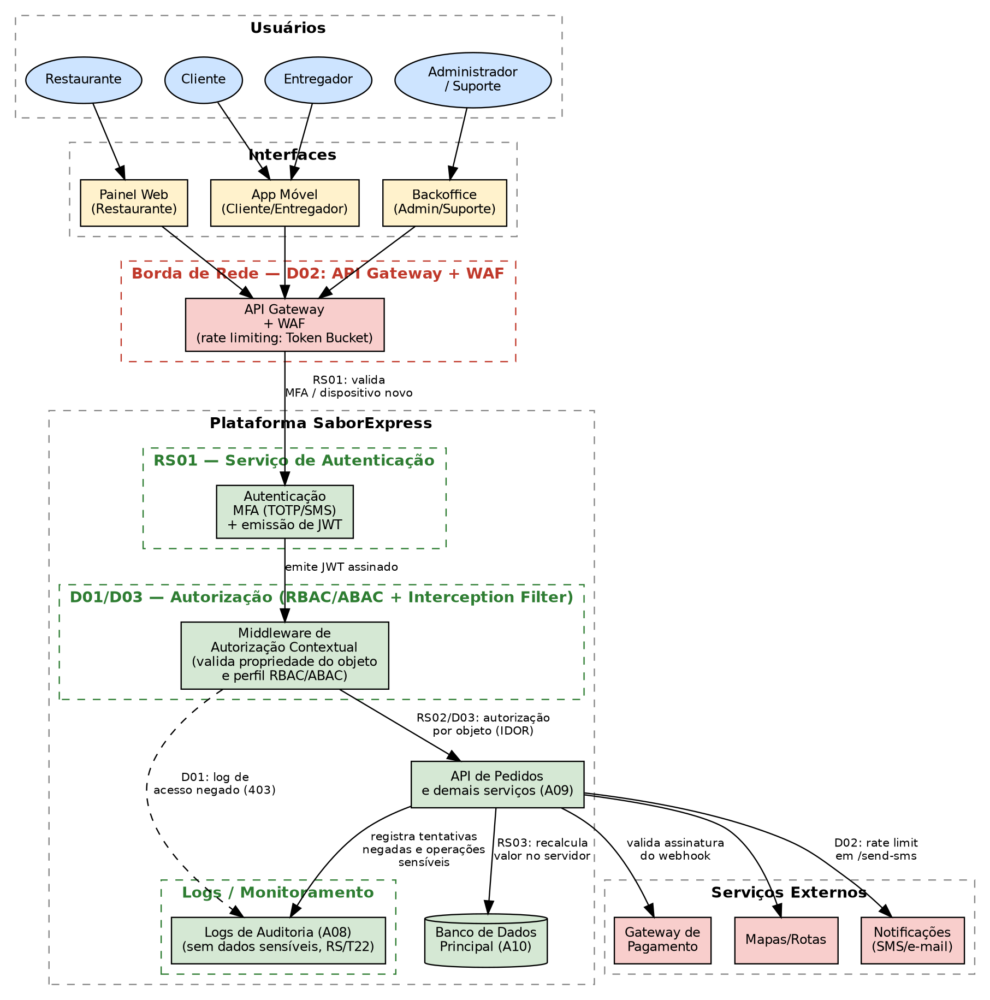

# Etapa 3 — Projeto de uma Arquitetura Segura

**Sistema:** SaborExpress — plataforma de delivery de comida
**Grupo:** 16 — Engenharia de Software Seguro
**Continuidade de:** [Etapa 2 — Análise e Tratamento de Riscos](etapa-2-riscos-nist.md)
**Última atualização:** <!-- atualize a data ao editar --> 07/08/2026

> Esta etapa transforma os riscos e controles da Etapa 2 em **requisitos de segurança** e
> **decisões de arquitetura**. Os riscos `R##` citados aqui são os mesmos da Etapa 2.

---

## Sumário

1. [Requisitos de segurança](#1-requisitos-de-segurança)
2. [Vulnerabilidades catalogadas](#2-vulnerabilidades-catalogadas)
3. [Diagrama da arquitetura segura](#3-diagrama-da-arquitetura-segura)
4. [Decisões de arquitetura](#4-decisões-de-arquitetura)

---

## 1. Requisitos de segurança

### Tabela de Requisitos de Segurança do SaborExpress

| ID | Risco de Origem (Etapa 2) | Requisito de Segurança | Critério de Verificação |
| :--- | :--- | :--- | :--- |
| **RS01** | **R01 — Tomada de contas de clientes** <br>*(Origem: T01 — Spoofing)* | **Autenticação Multifator (MFA) Adaptativa e Reautenticação Sensível:**<br>O sistema deverá exigir obrigatoriamente um segundo fator de autenticação (MFA via código SMS ou TOTP) sempre que uma tentativa de autenticação for realizada a partir de um dispositivo ou endereço IP não reconhecido pelo histórico do usuário. Adicionalmente, o backend deverá forçar a reautenticação estrita (senha ou MFA) imediatamente antes de processar qualquer alteração cadastral sensível (e-mail, telefone) ou modificação de meios de pagamento. | **1.** O login originado de um dispositivo ou IP inédito deve ser sumariamente bloqueado e recusado pela API enquanto o segundo fator correto não for fornecido.<br>**2.** Qualquer chamada de API para alteração de e-mail, telefone ou cartão de crédito deve retornar erro `HTTP 401 (Unauthorized)` se a reautenticação do usuário não tiver ocorrido com sucesso nos últimos 5 minutos anteriores ao envio do payload. |
| **RS02** | **R03 — Vazamento de dados via IDOR** <br>*(Origem: T18 — Info Disclosure)* | **Autorização Contextual Baseada em Objeto e Rate Limiting na API:**<br>A API de pedidos do SaborExpress deve validar, no lado do servidor (backend), se o usuário autenticado na sessão possui permissão de propriedade direta sobre o recurso solicitado (ID do pedido) antes de retornar qualquer dado cadastral, endereço residencial ou histórico de consumo. O controle deve empregar chaves de acesso indiretas e não-previsíveis (UUIDv4) e aplicar um limite de taxa (*rate limiting*) volumétrico de requisições por token e endereço IP. | **1.** Requisições autenticadas de clientes comuns tentando ler, editar ou excluir dados de pedidos pertencentes a outros IDs de usuários devem ser rejeitadas no backend com códigos de retorno `HTTP 403 (Forbidden)` ou `HTTP 404 (Not Found)` para evitar varreduras.<br>**2.** Chamadas repetitivas de consulta de pedidos que ultrapassem o limite de 60 requisições por minuto por IP/Token devem ser bloqueadas temporariamente, retornando o código de erro padrão de throttling `HTTP 429 (Too Many Requests)`. |
| **RS03** | **R02 — Manipulação do valor do pedido** <br>*(Origem: T07 — Tampering)* | **Validação e Recálculo Centralizado de Checkout no Servidor:**<br>O backend da aplicação deve realizar o recálculo compulsório e estrito do valor total de cada carrinho de compras no momento do checkout. Esse processo deve ignorar sumariamente quaisquer preços unitários, descontos ou valores totais enviados ou computados pela aplicação cliente (aplicativo móvel ou frontend web), utilizando exclusivamente como única fonte de verdade os preços vigentes dos itens armazenados de forma protegida no banco de dados corporativo. | **1.** Uma requisição de criação de pedido (checkout) contendo preços unitários alterados (abaixo dos valores definidos no catálogo do banco) deve resultar na cobrança automática do valor recalculado de forma correta pelo servidor ou na rejeição integral da transação com status `HTTP 400 (Bad Request)`.<br>**2.** Esse comportamento deve ser comprovado e auditado através de testes automatizados de injeção de parâmetros (alteração direta de payloads HTTP em proxy de interceptação), onde o valor transacionado final no gateway de pagamento deve corresponder exatamente ao catálogo oficial de preços do lojista. |

### Fundamentação Acadêmica e de Segurança da Informação

1. **RS01 (Mitigação de Spoofing e Acesso não Autorizado):**
   A exigência de MFA adaptativo ataca diretamente a vulnerabilidade de reuso de credenciais (*credential stuffing*). De acordo com os padrões do **NIST SP 800-63B** (Seção 5), a autenticação baseada em múltiplos fatores reduz severamente o risco de falsificação de identidade digital, enquanto a reautenticação em janelas curtas de tempo blinda a sessão do usuário contra sequestros de sessão ativos (*session hijacking*) em computadores ou celulares compartilhados.

2. **RS02 (Mitigação de Exposição de Informações por Broken Object Level Authorization):**
   O uso de UUIDv4 remove a previsibilidade típica de IDs sequenciais numéricos (evitando ataques de enumeração horizontal). A validação rigorosa de propriedade de dados no servidor impede a manifestação de falhas de controle de acesso ao nível de objeto, caracterizadas pelo **OWASP API Security Top 10** como a vulnerabilidade de maior criticidade no ecossistema moderno de APIs (API1:2023 - Broken Object Level Authorization).

3. **RS03 (Mitigação de Tampering de Dados e Confiança Imprópria no Cliente):**
   Um dos erros clássicos em engenharia de software é delegar regras de negócio críticas ou cálculos de segurança à camada de apresentação (dispositivo do cliente). Como o frontend do aplicativo roda em um ambiente hostil e fora do controle do SaborExpress, ele é facilmente manipulável através de proxies (como OWASP ZAP ou Burp Suite). O recálculo integral no servidor garante a conformidade com o princípio de segurança de **Validação de Entrada Rigorosa** e blinda a integridade financeira do marketplace.

<!-- RESPONSÁVEL: Fernando -->
<!-- TODO(Fernando): selecionar TRÊS riscos classificados como críticos ou altos na Etapa 2 e
     derivar um requisito de cada. Nem mais nem menos que três — o enunciado pede exatamente
     isso. RS01 abaixo é o modelo.
     Atenção: o requisito precisa ser VERIFICÁVEL. O teste é conseguir escrever, na última
     coluna, uma frase do tipo "a operação é recusada quando X" que alguém consiga executar.
     O enunciado rejeita explicitamente requisitos genéricos como "o sistema deverá ser seguro". -->
<!--
| ID | Risco de origem | Requisito de segurança | Critério de verificação |
|---|---|---|---|
| RS01 | R01 — Tomada de contas de clientes | O sistema deverá exigir um segundo fator de autenticação sempre que o login ocorrer a partir de um dispositivo não reconhecido, e deverá exigir reautenticação antes de alterar e-mail, telefone ou meio de pagamento | O login a partir de um dispositivo novo deve ser recusado enquanto o segundo fator não for informado; a alteração de meio de pagamento deve ser recusada quando a reautenticação não ocorrer nos últimos 5 minutos |
| RS02 | <- TODO -> | | |
| RS03 | <- TODO -> | | |
-->
<!-- TODO(Fernando): sugestão de riscos a usar em RS02 e RS03, se eles se confirmarem como
     críticos na priorização: R03 (extração em massa de dados pessoais pela API) → requisito de
     autorização por objeto no servidor; e o risco derivado de T29 (escalonamento de privilégio
     no backoffice) → requisito de verificação de permissão no servidor em toda operação
     administrativa. Confirme com a tabela de priorização da Etapa 2 antes de fechar. -->

---

## 2. Vulnerabilidades catalogadas

<!-- RESPONSÁVEL: Gabriel -->
<!-- TODO(Gabriel): para cada um dos três requisitos acima, encontrar UMA vulnerabilidade
     correspondente em catálogo reconhecido e preencher a linha. Três mapeamentos bastam.
     Catálogos aceitos pelo enunciado: CWE, OWASP Top 10, OWASP ASVS, OWASP Cheat Sheet Series.
     Cite o identificador exato (ex.: "CWE-287", "A01:2021") e confira o número no site antes
     de commitar — identificador errado é pior do que identificador ausente. -->

| Risco | Requisito | Vulnerabilidade ou categoria | Referência utilizada | Relação com o SaborExpress |
|---|---|---|---|---|
| R01 | RS01 | Autenticação imprópria / falha no gerenciamento de sessão | CWE-287 (*Improper Authentication*) e OWASP Top 10 A07:2021 — *Identification and Authentication Failures* | Sem segundo fator e sem limite de tentativas, uma lista de credenciais vazadas de outros serviços permite entrar em contas de clientes e usar o cartão salvo |
| R03 | RS02 | <!-- TODO: sugestão — CWE-639 (*Authorization Bypass Through User-Controlled Key*) e OWASP API Security Top 10 API1:2023 (BOLA) --> | | |
| — | RS03 | <!-- TODO: sugestão — CWE-602 (*Client-Side Enforcement of Server-Side Security*) e OWASP Top 10 A01:2021 — *Broken Access Control* --> | | |

**Links dos catálogos:** [CWE](https://cwe.mitre.org/), [OWASP Top 10](https://owasp.org/Top10/),
[OWASP API Security Top 10](https://owasp.org/API-Security/),
[OWASP ASVS](https://owasp.org/www-project-application-security-verification-standard/) e
[OWASP Cheat Sheet Series](https://cheatsheetseries.owasp.org/)

---

## 3. Diagrama da arquitetura segura

<!-- RESPONSÁVEL: Deivid -->
<!-- TODO(Deivid): produzir o diagrama e salvar fonte + imagem em diagramas/etapa-3/.
     Depois substituir este bloco pela imagem, no mesmo formato usado na Etapa 1. -->

> **Pendente.**

O enunciado (item 18.3) exige que o diagrama mostre:

- [ ] usuários;
- [ ] interface ou aplicação;
- [ ] **serviço de autenticação** (novo em relação ao diagrama da Etapa 1);
- [ ] **regras de autorização** (onde a permissão é verificada);
- [ ] banco de dados;
- [ ] **logs ou monitoramento** (novo);
- [ ] serviços externos relevantes;
- [ ] **posição dos principais controles** — ou seja, em que ponto do fluxo cada controle da
      Etapa 2 atua.

> **Dica:** a maneira mais rápida é partir do diagrama de contexto da Etapa 1 e acrescentar os
> três elementos que faltam (autenticação, autorização e logs), marcando sobre as setas onde
> cada controle entra. O que diferencia este diagrama do anterior é justamente mostrar **onde os
> controles ficam**, e não apenas quem fala com quem.

```

```

---

## 4. Decisões de arquitetura

<!-- RESPONSÁVEL: Fernando -->
<!-- TODO(Fernando): registrar TRÊS decisões. Cada uma precisa dos cinco campos abaixo.
     A D01 é o modelo. Uma decisão de arquitetura responde "o que escolhemos fazer e por quê",
     não "o que é bom em geral" — deve haver uma alternativa que foi descartada. -->

### D01 — Controle de Acesso Híbrido (RBAC/ABAC) com Validação Server-Side Estrita para Operações Administrativas

| Campo | Conteúdo |
| :--- | :--- |
| **Problema ou risco tratado** | **R29 — Execução de operações administrativas por atendente de suporte** (Origem: *T29 — Elevation of Privilege*). Trata-se de um risco crítico (Pontuação 12) que afeta a integridade financeira e de dados cadastrais de todo o backoffice. |
| **Decisão tomada** | Implementação de um modelo de controle de acesso híbrido combinando Controle de Acesso Baseado em Papéis (**RBAC**) para segregação geral e Controle de Acesso Baseado em Atributos (**ABAC**) para políticas dinâmicas (como limites máximos de alçada para estornos baseados no horário e histórico do atendente). Esta verificação é executada obrigatoriamente no lado do servidor (backend) a cada chamada de API administrativa (`P04`). O backend extrai a identidade e os atributos do usuário de um token criptográfico assinado (JWT) no cabeçalho `Authorization` e valida se o perfil possui privilégios para executar a operação antes de acessar o banco de dados. Nenhuma checagem é confiada ao frontend do painel administrativo (`A12`). |
| **Motivo** | Ocultar botões ou rotas na interface gráfica do usuário (frontend) é uma medida de usabilidade e não uma barreira de segurança. O código do frontend do painel administrativo (`A12`) roda em ambiente hostil (dispositivo do usuário) e pode ser inspecionado ou manipulado para descobrir e disparar requisições diretamente contra endpoints de API administrativos expostos na internet. Segundo as diretrizes do **OWASP Top 10 (A01:2021 — Broken Access Control)**, toda validação de privilégios de acesso a recursos deve ser centralizada e aplicada estritamente no backend. |
| **Componente afetado** | API Administrativa (`P04`), Painel Administrativo de Backoffice (`A12`) e Banco de Dados Principal (`A10`). |
| **Resultado esperado** | Tentativas de atendentes de suporte (`Role: Support`) de chamar rotas administrativas restritas (como alteração de comissão ou estornos acima do teto de alçada) por meio de ferramentas externas (ex: curl, Postman ou scripts) serão interceptadas e recusadas pelo backend com código `HTTP 403 Forbidden`, registrando um log de auditoria estruturado em nível `Critical`. |

<!--
### D01 — Verificar autorização no servidor em todas as operações administrativas

| Campo | Conteúdo |
|---|---|
| **Problema ou risco tratado** | Risco derivado de T29 — um atendente do suporte chama diretamente endpoints administrativos que não aparecem na interface dele |
| **Decisão tomada** | Toda operação administrativa verificará o perfil e o limite de alçada no servidor, a cada requisição, a partir do token de sessão — nunca a partir de um campo enviado pelo cliente |
| **Motivo** | Ocultar opções na interface não impede o acesso direto à API. O frontend é código que roda na máquina do usuário e pode ser modificado; a única verificação confiável é a do servidor |
| **Componente afetado** | API administrativa (P04) e o painel de backoffice (A12) |
| **Resultado esperado** | Requisições administrativas feitas por perfis sem permissão são recusadas com 403 e o evento é registrado em log de auditoria, mesmo quando a chamada não passa pela interface |
-->
### D02 — <!-- TODO(Fernando): título -->

| Campo | Conteúdo |
|---|---|
| **Problema ou risco tratado** | |
| **Decisão tomada** | |
| **Motivo** | |
| **Componente afetado** | |
| **Resultado esperado** | |

### D03 — <!-- TODO(Fernando): título -->

| Campo | Conteúdo |
|---|---|
| **Problema ou risco tratado** | |
| **Decisão tomada** | |
| **Motivo** | |
| **Componente afetado** | |
| **Resultado esperado** | |

<!-- TODO(Fernando): sugestões de decisões, caso ajudem —
     - Recalcular sempre o valor do pedido no servidor, ignorando o total enviado pelo app
       (trata o risco de Tampering de preço).
     - Validar a assinatura do webhook do gateway de pagamento antes de aceitar a confirmação
       (trata a falsificação de confirmação de pagamento em P08).
     - Guardar os segredos em cofre de segredos e nunca no código do aplicativo móvel
       (trata o vazamento de chaves de API, ativo A13).
     - Mascarar o endereço do cliente no app do entregador após a conclusão da entrega
       (trata o risco de coleta de endereços, T19). -->

---

**Continua em:** [Etapa 4 — Código Seguro e Testes de Segurança](etapa-4-codigo-seguro.md)
