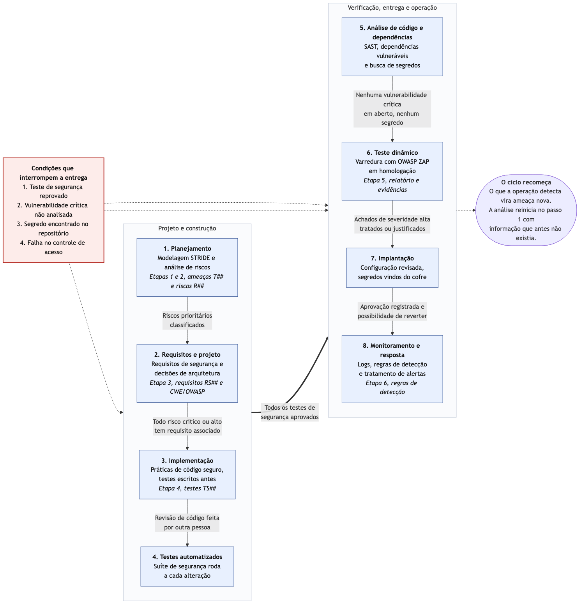

# Etapa 7 — DevSecOps e Vídeo Final

**Sistema:** SaborExpress — plataforma de delivery de comida
**Grupo:** 16 — Engenharia de Software Seguro
**Continuidade de:** [Etapa 6 — Detecção de Intrusões](etapa-6-deteccao-de-intrusoes.md)
**Última atualização:** <!-- atualize a data ao editar --> 08/08/2026

<!-- RESPONSÁVEL: Felipe (pipeline e roteiro); Todos (gravação) -->

> Roteiro descritivo. O enunciado é explícito: **não é necessário implementar um pipeline real**.

---

# Parte A — Pipeline DevSecOps proposto

## A.1 Ideia geral

No modo tradicional de desenvolver software, a segurança fica concentrada perto do fim. O sistema
é construído e, pouco antes de publicar, alguém revisa se ele está seguro. Esse arranjo tem dois
defeitos práticos.

O primeiro é o custo. Um problema encontrado na véspera da entrega já contaminou o código, e
corrigi-lo obriga a refazer decisões tomadas semanas antes. O segundo é mais sério. Como essa
revisão é a última coisa antes de entregar, ela é a que mais sofre pressão de prazo. Acaba sendo
encurtada ou pulada bem na hora em que o sistema mais precisa dela.

O DevSecOps responde a isso distribuindo a segurança pelo ciclo inteiro, do planejamento à
operação. Duas coisas sustentam esse arranjo. A primeira é a automação: tudo que uma máquina
consegue verificar sozinha, como testes de autorização, busca por dependências vulneráveis e
varredura por segredos no repositório, roda a cada alteração sem depender de alguém lembrar. A
segunda são as condições de bloqueio, definidas com antecedência, que impedem a entrega de
prosseguir quando algo dá errado. Elas existem para tirar essa decisão do calor do momento. Há
ainda uma mudança de responsabilidade: a segurança deixa de ser tarefa de um time à parte e passa
a integrar o trabalho de quem projeta, escreve e opera o sistema.

Este trabalho, no conjunto, percorreu esse pipeline. A Etapa 1 foi o planejamento, com a modelagem
de ameaças. A Etapa 2 transformou as ameaças em riscos priorizados. A Etapa 3 virou projeto, com
requisitos e decisões de arquitetura. A Etapa 4 chegou à implementação, com os testes escritos
antes do código. A Etapa 5 fez a verificação com ferramenta. A Etapa 6 tratou da operação, com
registro de eventos e regras de detecção. O que a Etapa 7 acrescenta é enxergar tudo isso como um
ciclo. O que o monitoramento detecta em produção volta como ameaça nova na rodada seguinte de
STRIDE, e a análise recomeça com informação que antes não existia.

## A.2 O pipeline

Cada momento do pipeline produz uma evidência verificável e só libera o momento seguinte quando
uma condição objetiva é atendida. A coluna de evidências aponta para os documentos deste
repositório, o que mostra que o pipeline descrito abaixo é o processo que o grupo percorreu, e não
um modelo genérico.

| Momento | Atividade de segurança | Evidência produzida | Condição para continuar |
|---|---|---|---|
| **Planejamento** | Modelagem de ameaças com STRIDE e análise de riscos | Tabelas de ameaças (`T##`) e de riscos (`R##`) — [Etapa 1](../docs/etapa-1-ameacas-stride.md) e [Etapa 2](../docs/etapa-2-riscos-nist.md) | Riscos prioritários identificados e classificados |
| **Requisitos e projeto** | Derivação de requisitos de segurança e decisões de arquitetura | Requisitos `RS##`, mapeamento CWE/OWASP e diagrama da arquitetura segura — [Etapa 3](../docs/etapa-3-arquitetura-segura.md) | Todo risco crítico ou alto tem ao menos um requisito associado |
| **Implementação** | Práticas de código seguro, com os testes escritos antes | Pseudocódigo e testes `TS##` — [Etapa 4](../docs/etapa-4-codigo-seguro.md) | Revisão de código feita por outra pessoa, sem pendência aberta |
| **Testes automatizados** | Execução dos testes de segurança a cada alteração | Relatório da suíte de testes | Todos os testes de segurança aprovados |
| **Análise de código e dependências** | Análise estática (SAST), verificação de dependências vulneráveis e varredura em busca de segredos no repositório | Relatório do SAST e do scanner de dependências | Nenhuma vulnerabilidade crítica ou alta em aberto; nenhum segredo detectado |
| **Teste dinâmico** | Varredura com ZAP contra o ambiente de homologação | Relatório de alertas e capturas — [Etapa 5](../docs/etapa-5-verificacao-vulnerabilidades.md) e `evidencias/etapa-5/` | Achados de severidade alta analisados e tratados ou justificados |
| **Implantação** | Publicação com configuração revisada e segredos vindos do cofre, nunca do código | Registro da implantação e da versão publicada | Aprovação registrada e possibilidade de reverter para a versão anterior |
| **Monitoramento e resposta** | Coleta de logs, regras de detecção e tratamento de alertas | Alertas, registros e histórico de incidentes — [Etapa 6](etapa-6-deteccao-de-intrusoes.md) | Incidentes abertos tratados; aprendizado devolvido ao início do ciclo |

## A.3 Condições que interrompem o pipeline

O enunciado pede pelo menos três. O grupo adotou quatro, escolhidas por tratarem dos riscos que
ficaram no topo da priorização da Etapa 2. Em todas elas, interromper quer dizer que a entrega não
avança enquanto alguém não analisar o caso e registrar uma decisão. Não quer dizer que o problema
tenha de estar resolvido.

**1. Teste de segurança reprovado.**
Cada teste `TS##` da Etapa 4 verifica um requisito `RS##`, que por sua vez saiu de um risco
concreto. Quando um deles reprova, o controle que trata aquele risco não está funcionando. Como os
testes foram definidos antes da implementação, a falha aponta que o código não atendeu ao
requisito, e não que o teste esteja mal escrito. Seguir com a entrega nessa situação é publicar
sabendo que um risco já identificado ficou descoberto.

**2. Vulnerabilidade crítica não analisada** no relatório de dependências ou do ZAP.
A condição fala em "não analisada", e não em "não corrigida", de propósito. Exigir zero
vulnerabilidades seria irreal, e uma regra irreal é contornada na primeira urgência. O que não pode
acontecer é a entrega seguir sem que ninguém tenha olhado. Toda vulnerabilidade crítica precisa ter
sido examinada e ter recebido uma decisão registrada, seja corrigir, mitigar ou aceitar com
justificativa e prazo de revisão, na forma prevista pela Etapa 2.

**3. Segredo encontrado no repositório** (chave de API, token ou senha).
As chaves de API dos serviços externos são o ativo A13, classificado como crítico, porque permitem
que um atacante se passe pela plataforma diante do gateway de pagamento ou do provedor de mapas.
Esta condição difere das outras em um ponto importante. Um segredo publicado já está comprometido,
mesmo que seja removido no commit seguinte, porque o histórico do Git o preserva e o repositório
pode já ter sido clonado. Aqui não basta apagar a linha e seguir: a retomada exige revogar e
substituir a chave exposta.

**4. Falha no controle de acesso** detectada pelos testes de autorização.
Falhas de autorização estão por trás dos riscos mais graves que o grupo levantou, entre eles a
extração em massa de dados pessoais pela API e o escalonamento de privilégio no backoffice. Essa
condição é indispensável porque esse tipo de falha é silencioso. Nada quebra, nenhuma tela dá erro
e nenhum usuário reclama. Sem um teste que a barre de forma explícita, ela chega à produção sem que
nada mais no pipeline perceba, e só aparece depois que alguém já a explorou.

## A.4 Diagrama do pipeline



O diagrama mostra os oito momentos em duas colunas, as condições de continuidade sobre cada seta,
as quatro condições de bloqueio na caixa vermelha e o fechamento do ciclo à direita. A ordem de
leitura é a coluna da esquerda de cima para baixo, depois a coluna da direita.

Arquivo-fonte: [`diagramas/etapa-7/pipeline-devsecops.mmd`](../diagramas/etapa-7/pipeline-devsecops.mmd).
Para regerar a imagem depois de editar:

```bash
npx -y @mermaid-js/mermaid-cli -i pipeline-devsecops.mmd -o pipeline-devsecops.png -w 1600 -b white
```

<details>
<summary>Código do diagrama (renderizado pelo GitHub)</summary>


</details>

---

# Parte B — Roteiro do vídeo final

**Duração:** 5 a 8 minutos. **Todos os integrantes participam.**

## B.1 Divisão por integrante

<!-- TODO(grupo): confirmar quem fala o quê e fechar os tempos. A proposta abaixo dá cerca de
     1 minuto para cada um, o que fecha em ~7 minutos com a abertura e o encerramento. -->

| Bloco | Tempo | Quem fala | Conteúdo |
|---|---|---|---|
| Abertura | 0:00–0:45 | Felipe | O sistema escolhido, por que um app de delivery, e o que o grupo produziu ao longo da disciplina |
| Ameaças e casos de abuso | 0:45–2:00 | Gabriel e Murillo | As ameaças STRIDE mais relevantes e um caso de abuso contado como história, do começo ao fim |
| Riscos prioritários | 2:00–3:00 | Fernando | Como as ameaças viraram riscos, o critério de pontuação e quais ficaram no topo |
| Arquitetura e decisões | 3:00–4:00 | Deivid | O diagrama da arquitetura segura e as decisões tomadas |
| Código seguro e verificação | 4:00–5:15 | Luis Fillipe e Murillo | As práticas de código com os testes escritos antes, e os achados do ZAP |
| Detecção e pipeline | 5:15–6:15 | Felipe | As regras de detecção e o pipeline DevSecOps |
| O que aprendemos | 6:15–7:00 | Todos, uma frase cada | Aprendizado individual e as maiores dificuldades |

## B.2 Roteiro detalhado

<!-- TODO(Felipe): escrever o texto de cada bloco depois que as Etapas 3 a 6 estiverem fechadas.
     Só faz sentido roteirizar quando houver o conteúdo definitivo para apresentar. -->

### Abertura — Felipe
<!-- TODO -->

### Ameaças e casos de abuso — Gabriel e Murillo
<!-- TODO -->

### Riscos prioritários — Fernando
<!-- TODO -->

### Arquitetura e decisões — Deivid
<!-- TODO -->

### Código seguro e verificação — Luis Fillipe e Murillo
<!-- TODO -->

### Detecção e pipeline — Felipe
<!-- TODO -->

### Encerramento — Todos
<!-- TODO -->

## B.3 Orientações de gravação

- **Não leia as tabelas.** O enunciado diz explicitamente que não é necessário mostrar todas as
  tabelas — ele quer as **decisões** e a **evolução** do trabalho. Mostre a tela do repositório e
  fale por cima.
- Cada um grava o seu bloco separadamente e alguém junta, ou o grupo grava uma chamada com
  compartilhamento de tela. A segunda opção é mais rápida e costuma ficar mais natural.
- Confira o áudio antes de gravar tudo — áudio ruim estraga um vídeo bom.
- O vídeo pode ser hospedado fora do repositório (YouTube não listado, por exemplo), mas **este
  roteiro precisa estar versionado aqui**, o que é exigência explícita do enunciado.

## B.4 Onde o vídeo foi publicado

| Item | Valor |
|---|---|
| Link | <!-- TODO --> |
| Duração | <!-- TODO --> |
| Data da gravação | <!-- TODO --> |

---

## Checklist final da disciplina

Conferir antes de considerar a entrega concluída:

- [ ] **Etapa 1** — ameaças STRIDE e casos de abuso
- [ ] **Etapa 2** — análise, priorização e tratamento dos riscos
- [ ] **Etapa 3** — três requisitos, três vulnerabilidades, um diagrama e três decisões
- [ ] **Etapa 4** — duas práticas de código seguro com testes
- [ ] **Etapa 5** — uma verificação com até três achados analisados
- [ ] **Etapa 6** — roteiro com três regras de detecção
- [ ] **Etapa 7** — pipeline, roteiro e vídeo final
- [ ] Commits próprios de **todos** os integrantes, atribuídos às contas corretas do GitHub
- [ ] Arquivos, diagramas e evidências versionados no repositório
- [ ] Nenhum `<!-- TODO -->` restante nos documentos
- [ ] Endereço do repositório entregue na plataforma da disciplina
