# Etapa 7 — DevSecOps e Vídeo Final

**Sistema:** SaborExpress — plataforma de delivery de comida
**Grupo:** 16 — Engenharia de Software Seguro
**Continuidade de:** [Etapa 6 — Detecção de Intrusões](etapa-6-deteccao-de-intrusoes.md)
**Última atualização:** 13/08/2026

<!-- RESPONSÁVEL: Felipe (pipeline e roteiro); Todos (gravação) -->

> Roteiro descritivo. O enunciado é explícito: **não é necessário implementar um pipeline real**.

---

# Parte A — Pipeline DevSecOps proposto

## A.1 Ideia geral

No modo tradicional de desenvolver software, a segurança fica concentrada perto do fim. O sistema
é construído e, pouco antes de publicar, alguém revisa se ele está seguro. Esse arranjo tem dois
defeitos práticos.

O primeiro é o custo. Um problema encontrado na véspera da entrega já contaminou o código, e
corrigi-lo obriga a refazer decisões tomadas semanas antes. O segundo é mais sério. Como essa
revisão é a última coisa antes de entregar, ela é a que mais sofre pressão de prazo. Acaba sendo
encurtada ou pulada bem na hora em que o sistema mais precisa dela.

O DevSecOps responde a isso distribuindo a segurança pelo ciclo inteiro, do planejamento à
operação. Duas coisas sustentam esse arranjo. A primeira é a automação: tudo que uma máquina
consegue verificar sozinha, como testes de autorização, busca por dependências vulneráveis e
varredura por segredos no repositório, roda a cada alteração sem depender de alguém lembrar. A
segunda são as condições de bloqueio, definidas com antecedência, que impedem a entrega de
prosseguir quando algo dá errado. Elas existem para tirar essa decisão do calor do momento. Há
ainda uma mudança de responsabilidade: a segurança deixa de ser tarefa de um time à parte e passa
a integrar o trabalho de quem projeta, escreve e opera o sistema.

Este trabalho, no conjunto, percorreu esse pipeline. A Etapa 1 foi o planejamento, com a modelagem
de ameaças. A Etapa 2 transformou as ameaças em riscos priorizados. A Etapa 3 virou projeto, com
requisitos e decisões de arquitetura. A Etapa 4 chegou à implementação, com os testes escritos
antes do código. A Etapa 5 fez a verificação com ferramenta. A Etapa 6 tratou da operação, com
registro de eventos e regras de detecção. O que a Etapa 7 acrescenta é enxergar tudo isso como um
ciclo. O que o monitoramento detecta em produção volta como ameaça nova na rodada seguinte de
STRIDE, e a análise recomeça com informação que antes não existia.

## A.2 O pipeline

Cada momento do pipeline produz uma evidência verificável e só libera o momento seguinte quando
uma condição objetiva é atendida. A coluna de evidências aponta para os documentos deste
repositório, o que mostra que o pipeline descrito abaixo é o processo que o grupo percorreu, e não
um modelo genérico.

| Momento | Atividade de segurança | Evidência produzida | Condição para continuar |
|---|---|---|---|
| **Planejamento** | Modelagem de ameaças com STRIDE e análise de riscos | Tabelas de ameaças (`T##`) e de riscos (`R##`) — [Etapa 1](../docs/etapa-1-ameacas-stride.md) e [Etapa 2](../docs/etapa-2-riscos-nist.md) | Riscos prioritários identificados e classificados |
| **Requisitos e projeto** | Derivação de requisitos de segurança e decisões de arquitetura | Requisitos `RS##`, mapeamento CWE/OWASP e diagrama da arquitetura segura — [Etapa 3](../docs/etapa-3-arquitetura-segura.md) | Todo risco crítico ou alto tem ao menos um requisito associado |
| **Implementação** | Práticas de código seguro, com os testes escritos antes | Pseudocódigo e testes `TS##` — [Etapa 4](../docs/etapa-4-codigo-seguro.md) | Revisão de código feita por outra pessoa, sem pendência aberta |
| **Testes automatizados** | Execução dos testes de segurança a cada alteração | Relatório da suíte de testes | Todos os testes de segurança aprovados |
| **Análise de código e dependências** | Análise estática (SAST), verificação de dependências vulneráveis e varredura em busca de segredos no repositório | Relatório do SAST e do scanner de dependências | Nenhuma vulnerabilidade crítica ou alta em aberto; nenhum segredo detectado |
| **Teste dinâmico** | Varredura com ZAP contra o ambiente de homologação | Relatório de alertas e capturas — [Etapa 5](../docs/etapa-5-verificacao-vulnerabilidades.md) e `evidencias/etapa-5/` | Achados de severidade alta analisados e tratados ou justificados |
| **Implantação** | Publicação com configuração revisada e segredos vindos do cofre, nunca do código | Registro da implantação e da versão publicada | Aprovação registrada e possibilidade de reverter para a versão anterior |
| **Monitoramento e resposta** | Coleta de logs, regras de detecção e tratamento de alertas | Alertas, registros e histórico de incidentes — [Etapa 6](etapa-6-deteccao-de-intrusoes.md) | Incidentes abertos tratados; aprendizado devolvido ao início do ciclo |

## A.3 Condições que interrompem o pipeline

O enunciado pede pelo menos três. O grupo adotou quatro, escolhidas por tratarem dos riscos que
ficaram no topo da priorização da Etapa 2. Em todas elas, interromper quer dizer que a entrega não
avança enquanto alguém não analisar o caso e registrar uma decisão. Não quer dizer que o problema
tenha de estar resolvido.

**1. Teste de segurança reprovado.**
Cada teste `TS##` da Etapa 4 verifica um requisito `RS##`, que por sua vez saiu de um risco
concreto. Quando um deles reprova, o controle que trata aquele risco não está funcionando. Como os
testes foram definidos antes da implementação, a falha aponta que o código não atendeu ao
requisito, e não que o teste esteja mal escrito. Seguir com a entrega nessa situação é publicar
sabendo que um risco já identificado ficou descoberto.

**2. Vulnerabilidade crítica não analisada** no relatório de dependências ou do ZAP.
A condição fala em "não analisada", e não em "não corrigida", de propósito. Exigir zero
vulnerabilidades seria irreal, e uma regra irreal é contornada na primeira urgência. O que não pode
acontecer é a entrega seguir sem que ninguém tenha olhado. Toda vulnerabilidade crítica precisa ter
sido examinada e ter recebido uma decisão registrada, seja corrigir, mitigar ou aceitar com
justificativa e prazo de revisão, na forma prevista pela Etapa 2.

**3. Segredo encontrado no repositório** (chave de API, token ou senha).
As chaves de API dos serviços externos são o ativo A13, classificado como crítico, porque permitem
que um atacante se passe pela plataforma diante do gateway de pagamento ou do provedor de mapas.
Esta condição difere das outras em um ponto importante. Um segredo publicado já está comprometido,
mesmo que seja removido no commit seguinte, porque o histórico do Git o preserva e o repositório
pode já ter sido clonado. Aqui não basta apagar a linha e seguir: a retomada exige revogar e
substituir a chave exposta.

**4. Falha no controle de acesso** detectada pelos testes de autorização.
Falhas de autorização estão por trás dos riscos mais graves que o grupo levantou, entre eles a
extração em massa de dados pessoais pela API e o escalonamento de privilégio no backoffice. Essa
condição é indispensável porque esse tipo de falha é silencioso. Nada quebra, nenhuma tela dá erro
e nenhum usuário reclama. Sem um teste que a barre de forma explícita, ela chega à produção sem que
nada mais no pipeline perceba, e só aparece depois que alguém já a explorou.

## A.4 Diagrama do pipeline


O diagrama mostra os oito momentos em duas colunas, as condições de continuidade sobre cada seta,
as quatro condições de bloqueio na caixa vermelha e o fechamento do ciclo à direita. A ordem de
leitura é a coluna da esquerda de cima para baixo, depois a coluna da direita.

Arquivo-fonte: [`diagramas/etapa-7/pipeline-devsecops.mmd`](../diagramas/etapa-7/pipeline-devsecops.mmd).
Para regerar a imagem depois de editar:

```bash
npx -y @mermaid-js/mermaid-cli -i pipeline-devsecops.mmd -o pipeline-devsecops.png -w 1600 -b white
```

```mermaid
flowchart LR
    subgraph COL1["Projeto e construção"]
        direction TB
        P["<b>1. Planejamento</b><br/>Modelagem STRIDE e análise de riscos<br/><i>Etapas 1 e 2, ameaças T## e riscos R##</i>"]
        R["<b>2. Requisitos e projeto</b><br/>Requisitos de segurança e<br/>decisões de arquitetura<br/><i>Etapa 3, requisitos RS## e CWE/OWASP</i>"]
        I["<b>3. Implementação</b><br/>Práticas de código seguro,<br/>testes escritos antes<br/><i>Etapa 4, testes TS##</i>"]
        T["<b>4. Testes automatizados</b><br/>Suíte de segurança roda<br/>a cada alteração"]
        P -->|Riscos prioritários<br/>classificados| R
        R -->|Todo risco crítico ou alto<br/>tem requisito associado| I
        I -->|Revisão de código feita<br/>por outra pessoa| T
    end

    subgraph COL2["Verificação, entrega e operação"]
        direction TB
        S["<b>5. Análise de código e dependências</b><br/>SAST, dependências vulneráveis<br/>e busca de segredos"]
        D["<b>6. Teste dinâmico</b><br/>Varredura com OWASP ZAP<br/>em homologação<br/><i>Etapa 5, relatório e evidências</i>"]
        E["<b>7. Implantação</b><br/>Configuração revisada,<br/>segredos vindos do cofre"]
        M["<b>8. Monitoramento e resposta</b><br/>Logs, regras de detecção<br/>e tratamento de alertas<br/><i>Etapa 6, regras de detecção</i>"]
        S -->|Nenhuma vulnerabilidade crítica<br/>em aberto, nenhum segredo| D
        D -->|Achados de severidade alta<br/>tratados ou justificados| E
        E -->|Aprovação registrada e<br/>possibilidade de reverter| M
    end

    C(["<b>O ciclo recomeça</b><br/>O que a operação detecta vira ameaça nova.<br/>A análise reinicia no passo 1 com<br/>informação que antes não existia."])

    B["<b>Condições que interrompem a entrega</b><br/>1. Teste de segurança reprovado<br/>2. Vulnerabilidade crítica não analisada<br/>3. Segredo encontrado no repositório<br/>4. Falha no controle de acesso"]

    T ==>|Todos os testes de<br/>segurança aprovados| S
    M -.-> C
    B -.-> T
    B -.-> S
    B -.-> D

    classDef fase fill:#e8f0fe,stroke:#3c5a99,stroke-width:1px,color:#111
    classDef bloqueio fill:#fdecea,stroke:#b3261e,stroke-width:2px,color:#111
    class P,R,I,T,S,D,E,M fase
    class B bloqueio
    style COL1 fill:#fafbfd,stroke:#c3cbd9
    style COL2 fill:#fafbfd,stroke:#c3cbd9
```

<details>
<summary>Código do diagrama (renderizado pelo GitHub)</summary>



</details>

---

# Parte B — Roteiro do vídeo final

**Duração:** 5 a 8 minutos. **Todos os integrantes participam.**

## B.1 Divisão por integrante

Cerca de um minuto por integrante, fechando em torno de sete minutos, dentro da faixa de 5 a 8
pedida pelo enunciado.

> **Todos os seis integrantes falam no vídeo**, cada um apresentando a parte em que trabalhou. O
> enunciado exige que todos participem e permite que a divisão seja organizada como o grupo
> preferir. O encerramento é feito por uma pessoa só, em nome do grupo, porque uma rodada final com
> seis falas curtas alonga o vídeo sem acrescentar conteúdo.

| Bloco | Tempo | Quem fala | Conteúdo |
|---|---|---|---|
| Abertura | 0:00–0:45 | Felipe | O sistema escolhido, por que um app de delivery, e o que o grupo produziu ao longo da disciplina |
| Ameaças e casos de abuso | 0:45–2:00 | Gabriel e Murillo | As ameaças STRIDE mais relevantes e um caso de abuso contado como história, do começo ao fim |
| Riscos prioritários | 2:00–3:00 | Fernando | Como as ameaças viraram riscos, o critério de pontuação e quais ficaram no topo |
| Arquitetura e decisões | 3:00–4:00 | Deivid | O diagrama da arquitetura segura e as decisões tomadas |
| Código seguro e verificação | 4:00–5:15 | Luis Fillipe e Murillo | As práticas de código com os testes escritos antes, e os achados do ZAP |
| Detecção e pipeline | 5:15–6:15 | Felipe | As regras de detecção e o pipeline DevSecOps |
| Encerramento e aprendizados | 6:15–7:00 | Felipe | O que o grupo aprendeu, as maiores dificuldades e o fecho |

## B.2 Roteiro detalhado

**Como usar este roteiro.** Cada bloco traz o que deixar aberto na tela e uma fala sugerida. O
texto não precisa ser lido palavra por palavra, e fica melhor se cada um adaptar para o seu jeito
de falar. O que precisa ser respeitado é o tempo e a ordem dos assuntos, porque os blocos se
encadeiam.

Regra geral para todos: **fale sobre a decisão, não leia a tabela.** O professor foi explícito
sobre isso e disse que está mais interessado em ver se o grupo entendeu o processo do que na
execução perfeita de cada etapa.

---

### Abertura — Felipe (0:00 a 0:45)

**Na tela:** página inicial do repositório no GitHub, mostrando a estrutura de pastas.

> Oi, somos o Grupo 16 e esse é o trabalho de Engenharia de Software Seguro. O sistema que a gente
> analisou é o SaborExpress, uma plataforma de delivery de comida, tipo iFood.
>
> A gente escolheu delivery por um motivo específico: é um sistema em que quatro tipos de usuário
> com interesses conflitantes convivem no mesmo lugar. Cliente, restaurante, entregador e
> administrador. Cada um deles pode abusar do sistema em prejuízo dos outros, e isso deu material
> para encontrar ameaça em todas as seis categorias do STRIDE sem precisar forçar cenário.
>
> Tem também dinheiro de terceiros sob custódia da plataforma, e dado pessoal que combina endereço
> residencial com telefone e rotina, que é onde a coisa fica séria de verdade.
>
> O sistema não foi implementado. O trabalho é a análise de segurança dele, em sete etapas, e é
> isso que a gente vai mostrar agora.

---

### Ameaças e casos de abuso — Gabriel e Murillo (0:45 a 2:00)

**Na tela:** a tabela do STRIDE na Etapa 1, e depois o diagrama de casos de abuso.

**Gabriel:**

> A primeira etapa foi modelagem de ameaças com STRIDE. A gente levantou 31 ameaças, cobrindo as
> seis categorias, sempre amarradas a um componente concreto do sistema.
>
> Um exemplo que vale mostrar: o endpoint que recebe a confirmação de pagamento do gateway não
> valida a assinatura da requisição. Isso significa que dá para mandar um "pagamento aprovado"
> falso e liberar pedido sem ninguém ter pago. É uma ameaça de Spoofing, e virou um dos riscos
> altos da etapa seguinte.

**Murillo:**

> Depois transformamos essas ameaças em casos de abuso, que é contar a história do ataque do começo
> ao fim. Foram oito.
>
> O primeiro deles é o cadastro de entregador com identidade falsa. O atacante consegue uma CNH de
> terceiro, cria a conta, o sistema aprova sem comparar a selfie com o documento, e a partir daí
> ele recebe nome, telefone e endereço completo de cada cliente que aceita entregar. Ele nem
> precisa entregar nada: pode cancelar a corrida depois de ver o endereço.
>
> Esse caso mostra por que a gente insiste que o dado mais crítico aqui não é o cartão, é o
> endereço. Cartão clonado o banco estorna. Endereço vazado não tem como desfazer.

---

### Riscos prioritários — Fernando (2:00 a 3:00)

**Na tela:** a tabela de priorização da Etapa 2 e depois o mapeamento NIST.

> Na Etapa 2 a gente transformou as ameaças em risco. Ameaça é o que pode acontecer,
> vulnerabilidade é a condição que permite, e risco é isso combinado com a consequência. Foram 31
> riscos, cada um com probabilidade e impacto de 1 a 4, e a pontuação é a multiplicação dos dois.
>
> Deu nove riscos críticos. O primeiro colocado é a extração em massa de dados de clientes pela
> API, por uma falha de autorização por objeto.
>
> E aqui vale explicar o critério, porque ele empatou com outro risco na pontuação e mesmo assim
> ficou na frente. Os dois davam 12. O outro era sequestro de conta. A gente colocou o vazamento
> primeiro por causa da irreversibilidade: conta invadida você bloqueia e estorna as transações,
> dado vazado não volta atrás, e ainda gera dever de notificar a ANPD pela LGPD.
>
> Depois mapeamos cada risco para as funções do NIST. Protect apareceu em todos os 31, o que faz
> sentido num sistema baseado em API. Já Govern e Identify a gente marcou de forma seletiva, só
> onde havia mesmo política a definir ou inventário a levantar, porque marcar todas as funções em
> todos os riscos esvazia o exercício.

---

### Arquitetura e decisões — Deivid (3:00 a 4:00)

**Na tela:** o diagrama da arquitetura segura da Etapa 3, aberto e com zoom suficiente para ler os
rótulos das setas.

> Na Etapa 3 os riscos viraram requisitos de segurança e decisões de arquitetura.
>
> São três requisitos, derivados dos riscos prioritários. O RS01 exige autenticação multifator
> adaptativa e reautenticação para operação sensível. O RS02 exige autorização contextual por
> objeto e limite de requisições na API. O RS03 exige que o valor do checkout seja recalculado no
> servidor.
>
> Cada um foi mapeado para uma vulnerabilidade catalogada. O RS01 corresponde à CWE-287, de
> autenticação imprópria. O RS02 à CWE-639, que é desvio de autorização por chave controlada pelo
> usuário. E o RS03 à CWE-602, que é confiar no cliente para aplicar regra que deveria estar no
> servidor.
>
> Neste diagrama a requisição entra pelos quatro perfis de usuário, passa pelas três interfaces e
> chega no gateway com WAF e limite de requisições, que é a decisão D02. Só depois disso ela chega
> no serviço de autenticação, que valida o MFA quando o dispositivo não é reconhecido e emite o
> token. Aí ela passa pelo middleware de autorização, que é onde as decisões D01 e D03 atuam
> verificando o perfil e a propriedade do objeto, e só então alcança a API de pedidos e o banco.
>
> O detalhe que a gente fez questão de mostrar são os rótulos sobre as setas. Cada requisito e cada
> decisão está marcado exatamente no ponto do fluxo em que ele age, e não só listado numa legenda.
> Dá para ver onde o valor do pedido é recalculado, onde a assinatura do webhook é conferida e por
> onde os acessos negados chegam no log de auditoria.
>
> E a ideia que resume as três decisões é a validação estrita no lado do servidor. Esconder um
> botão na interface não impede ninguém de chamar a API direto, então a única verificação que vale
> é a que acontece no backend.

---

### Código seguro e verificação — Luis Fillipe e Murillo (4:00 a 5:15)

**Na tela:** o pseudocódigo da prática 1 na Etapa 4, e depois as capturas do ZAP na Etapa 5.

**Luis Fillipe:**

> Na Etapa 4 a gente escolheu duas práticas de código seguro. O que importa aqui é a ordem: **os
> testes foram escritos antes da implementação**.
>
> Na primeira prática, sobre autorização, o teste diz que um cliente pedindo o pedido de outro tem
> que receber recusa, e que pedindo o próprio tem que receber os dados. Só depois vem o
> pseudocódigo.
>
> Tem um detalhe que a gente achou interessante: quando o pedido não é seu, a resposta certa é 404
> e não 403. Se você responde 403, você confirma para o atacante que aquele identificador existe, e
> ele consegue mapear a base inteira mesmo sem conseguir ler nada. Respondendo 404 nos dois casos,
> "não existe" e "não é seu" ficam indistinguíveis.
>
> A segunda prática é autenticação multifator adaptativa, e ela trata o risco que ficou como a
> tomada de contas de clientes. Adaptativa quer dizer que o segundo fator não é pedido toda vez,
> só quando o login vem de um dispositivo ou endereço que o sistema não reconhece. Isso evita
> transformar segurança em incômodo diário, que é o que faz usuário procurar jeito de burlar.
>
> E aqui aparece a mesma ideia da primeira prática, em outro lugar. Quando o e-mail não existe e
> quando a senha está errada, o sistema responde exatamente a mesma coisa. Se ele respondesse
> diferente, daria para descobrir quais e-mails têm conta na plataforma só testando, que é uma das
> ameaças que a gente tinha levantado lá na Etapa 1.

**Murillo:**

> Na Etapa 5 a gente rodou o OWASP ZAP contra o OWASP Juice Shop, que é uma aplicação feita pela
> própria OWASP para treino. Vale dizer que a gente testou só o ambiente local autorizado, nada de
> sistema de terceiro.
>
> Saíram seis resultados, e a gente analisou três em profundidade: ausência do cabeçalho de
> Content Security Policy, configuração permissiva entre origens, e o site respondendo em HTTP sem
> redirecionar para HTTPS. Cada um com a CWE correspondente e a correção proposta.
>
> Os outros três a gente registrou como descartados, com o print de cada um, explicando por que
> não aprofundou: dois são informativos e um tem confiança baixa segundo a própria ferramenta.
> Achamos importante deixar isso documentado em vez de fingir que só encontramos o que era
> conveniente analisar.

---

### Detecção e pipeline — Felipe (5:15 a 6:15)

**Na tela:** as regras de detecção da Etapa 6, e depois o diagrama do pipeline da Etapa 7.

> As Etapas 6 e 7 tratam do que acontece depois que o sistema está no ar.
>
> A Etapa 6 parte de uma constatação: um cliente pedindo comida e um atacante tentando invadir
> contas chegam no mesmo endpoint, pelo mesmo app. Requisição por requisição eles são idênticos. A
> diferença aparece no conjunto, e é isso que a detecção lê.
>
> Definimos três regras. Uma para tentativa de login em massa, uma para extração de dados pela API,
> e uma que alerta quando a entrega é confirmada a mais de 300 metros do endereço de destino.
>
> Essa terceira explica por que detecção não substitui prevenção, e nem o contrário. O entregador
> **tem permissão** para marcar o pedido como entregue. Não existe controle preventivo que bloqueie
> isso sem quebrar o produto. O que separa o uso normal do abuso é o contexto, e só o registro
> mostra o contexto.
>
> Por fim, a Etapa 7 junta tudo num pipeline DevSecOps. Cada momento produz uma evidência e só
> libera o próximo quando uma condição objetiva é atendida. E existem quatro condições que
> interrompem a entrega, sendo a mais dura a de segredo encontrado no repositório, porque aí não
> basta apagar a linha: o segredo já está comprometido e a chave precisa ser trocada.
>
> Repara que a seta volta do monitoramento para o planejamento. O que a operação detecta vira
> ameaça nova na próxima rodada de STRIDE. Não é uma fila, é um ciclo.

---

### Encerramento e aprendizados — Felipe (6:15 a 7:00)

**Na tela:** o backlog do repositório com o quadro de tarefas, e depois o histórico de commits.

> Para fechar, o que a gente tira de tudo isso.
>
> A primeira coisa que surpreendeu o grupo foi o quanto é difícil separar ameaça, vulnerabilidade e
> risco na prática. No começo a gente escrevia o risco só repetindo a ameaça com outras palavras. O
> que resolveu foi fixar isso no documento logo no início: ameaça é o que pode acontecer,
> vulnerabilidade é a condição que permite, e risco é a combinação disso com a consequência.
>
> A segunda foi perceber que ameaça genérica não serve para nada. "Um atacante rouba a senha" vale
> pouco. "Um atacante usa uma lista de credenciais vazadas porque o login não exige segundo fator
> nem limita tentativas, e usa o cartão que o cliente deixou salvo" é o que dá para priorizar e
> tratar depois.
>
> A terceira apareceu quando a gente rodou a ferramenta. O ZAP encontra problema de configuração,
> mas não encontra falha de lógica de negócio. Nenhum scanner ia descobrir sozinho que um
> entregador pode marcar como entregue sem entregar, porque tecnicamente isso é uma operação
> permitida. Ferramenta não substitui a análise, ela complementa.
>
> E a quarta, que é a mais importante: boa parte dos abusos que a gente identificou é cometida por
> usuário legítimo, usando permissão que ele realmente tem. Não existe controle preventivo capaz de
> bloquear isso sem inviabilizar o produto. Foi aí que ficou claro por que prevenção e detecção não
> são a mesma coisa, e por que as duas precisam existir juntas.
>
> Sobre o processo em si, a maior dificuldade foi manter a coerência com seis pessoas escrevendo em
> paralelo. Apareceu risco duplicado, tabela de rastreabilidade contradizendo o texto e contagem
> que não batia. A gente corrigiu tudo por commits específicos, e isso está no histórico do
> repositório.
>
> No fim, o que ficou mais claro é que segurança não é uma etapa no fim do projeto. Ela começou
> antes de existir uma linha de código e continua depois que o sistema está no ar. Obrigado!

---


## B.3 Orientações de gravação

- **Não leia as tabelas.** O enunciado diz explicitamente que não é necessário mostrar todas as
  tabelas — ele quer as **decisões** e a **evolução** do trabalho. Mostre a tela do repositório e
  fale por cima.
- Cada um grava o seu bloco separadamente e alguém junta, ou o grupo grava uma chamada com
  compartilhamento de tela. A segunda opção é mais rápida e costuma ficar mais natural.
- Confira o áudio antes de gravar tudo — áudio ruim estraga um vídeo bom.
- O vídeo pode ser hospedado fora do repositório (YouTube não listado, por exemplo), mas **este
  roteiro precisa estar versionado aqui**, o que é exigência explícita do enunciado.

## B.4 Onde o vídeo foi publicado

| Item | Valor |
|---|---|
| Link | <!-- TODO --> |
| Duração | <!-- TODO --> |
| Data da gravação | <!-- TODO --> |

---

## Checklist final da disciplina

Conferir antes de considerar a entrega concluída:

- [ ] **Etapa 1** — ameaças STRIDE e casos de abuso
- [ ] **Etapa 2** — análise, priorização e tratamento dos riscos
- [ ] **Etapa 3** — três requisitos, três vulnerabilidades, um diagrama e três decisões
- [ ] **Etapa 4** — duas práticas de código seguro com testes
- [ ] **Etapa 5** — uma verificação com até três achados analisados
- [ ] **Etapa 6** — roteiro com três regras de detecção
- [ ] **Etapa 7** — pipeline, roteiro e vídeo final
- [ ] Commits próprios de **todos** os integrantes, atribuídos às contas corretas do GitHub
- [ ] Arquivos, diagramas e evidências versionados no repositório
- [ ] Nenhum `<!-- TODO -->` restante nos documentos
- [ ] Endereço do repositório entregue na plataforma da disciplina
